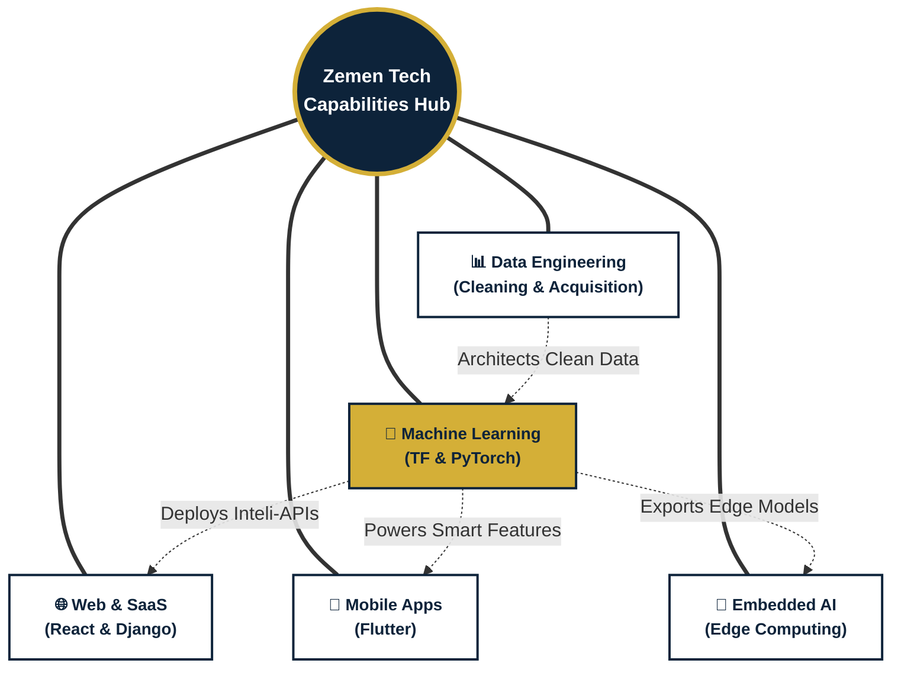

  
# 🇪🇹 Zemen Tech | ዘመን ቴክ
### *Engineering the Digital Era*

---

**Zemen Tech** is an innovative software development collective in Ethiopia specializing in AI-integrated full-stack solutions. Our mission is to build scalable digital ecosystems and drive seamless AI integration to resolve complex challenges and empower businesses for the digital era.

 

## 🚀 Vast Capabilities

At Zemen Tech, we pride ourselves on our deep expertise and ability to deliver comprehensive solutions across a broad spectrum of modern technologies:

### 🌐 Web Development & SaaS
We build scalable, multi-tenant architectures (e.g., *GrandStay OS*) utilizing top-tier frameworks. Our toolset prioritizes **React, Django, Vue.js, and Node.js** to deliver dynamic, robust, and high-performance applications.

### 📱 Mobile App Development
We deliver beautiful, responsive, and native-feeling cross-platform mobile solutions using **Flutter**, ensuring a unified and fluid user experience across both iOS and Android ecosystems.

### 🧠 Machine Learning (ML)
We integrate deep intelligence into operations. Our expertise extends to complex predictive modeling and seamlessly deploying robust **TensorFlow** and **PyTorch** models into production-scale environments.

### 🔌 Embedded AI Systems
We engineer intelligent agents designed to operate optimally within microcontrollers and embedded systems, unleashing the power of low-latency Edge Computing directly to hardware.

### 📊 Data Services
Quality intelligence requires quality execution. We specialize in end-to-end data pipelines: comprehensive **Data Cleaning, Preprocessing, Data Acquisition**, and transforming raw data into inherently scalable assets for analytical workloads.

 

## 🧩 Team Capabilities Hub

Our cross-functional domains work harmoniously to create completely holistic software solutions. The diagram below illustrates how our distinct disciplines feed into and optimize one another:

 

## 🛠️ Tech Stack

We utilize industry-leading technologies to bring digital ecosystems to life:

  
  
  
  
   
  
  
  

 

## 📩 Connect with Us

Ready to engineer your digital evolution? Reach out to collaborate!

- 📧 **Email:** [contact@zementech.et](mailto:contact@zementech.et)
- 💼 **LinkedIn:** [Zemen Tech](#)
- 🌐 **Website:** [zementech.et](#)

 

  <b><i>Engineering scalable, AI-powered solutions.</i></b>

